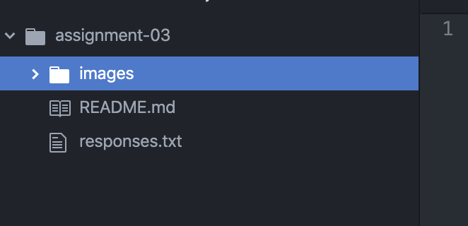

# Assignment 3
## Ellie Knipfer

[Absolute URL to a frequently visted site](https://www.google.com)

[Relative URL to response.txt](../assignment-03/responses.txt)

**Things I've learned so far:**
  1. The difference between absolute URLs and Relative URLs and how to correctly write both with Markup language. 
  2. How to create a file on your computer, open it in Atom, create files and folders in atom, and upload that file to GitHub.
  3. The internet sends binary information made of bits. Bits are called binary code becuase it has to possible states; 1 or 0. 
