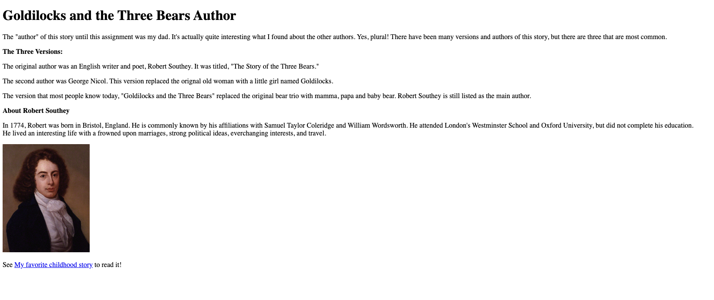
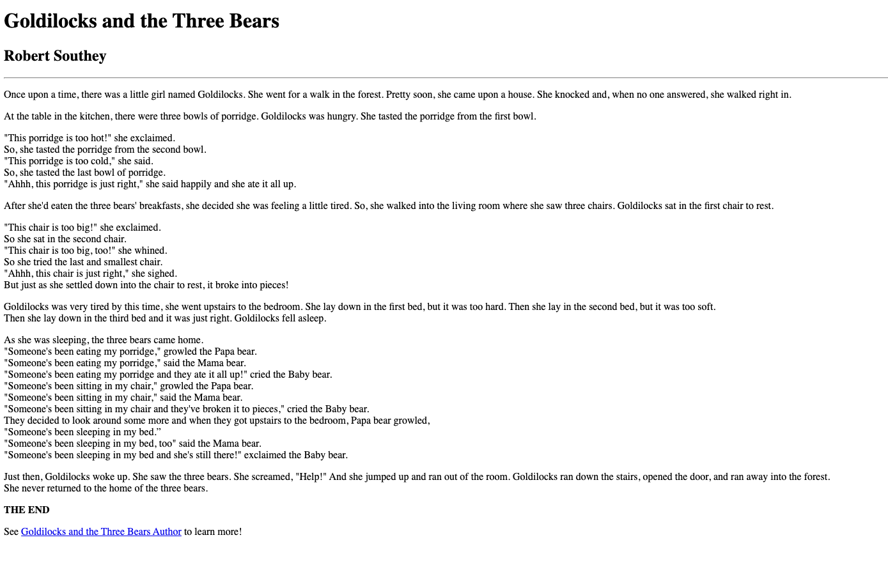

## Week 5 Questions:

1. Wayback Machine: I went to Amazon. It looks completely different than today. All of the text under *browse* appear on the page as hyperlinks. Now, although they function the same way, they are not blue and underlined. The site almost looks fake. When I click on a site that looks like this one today, I would think it was spam or not reliable. The text, graphics, and tabs are not seamless like they are now.
2. I learned different aspects of HTML; one-tag elements, two-tag elements, heading, paragraphs, links, images, etc. I learned how to upload repositories from the GitHub desktop.
Overall, It took me some time to understand how to navigate Atom, GitHub Desktop and Github all together.
I had some difficulties with links and pictures at first but was able to figure it out. I also had a "DS Store" file that showed up when I pushed the repository to Github. I deleted it from desktop and atom, committed the changes and pushed it again. That worked but I am not sure what that was or where it came from. I am also not sure what the screenshot should be of. It was listed under completing both pages, so I took a screenshot of both pages.
3. Screenshots of about.html and index.html

